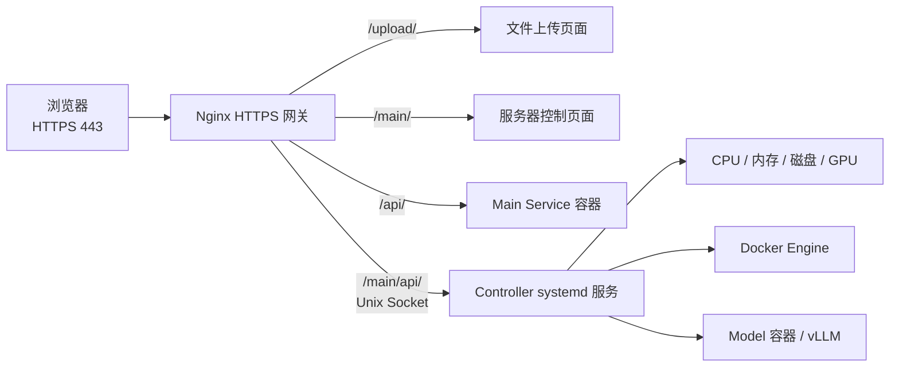

# Omni AI Controller

用于管理本机 `omni_ai_model` Docker 服务、采集硬件状态并与模型进行多轮对话。项目同时提供交互式控制台和由 systemd 托管的宿主机控制 API。

## 系统架构



只有 Nginx 对外监听 HTTPS 443。控制 API 通过挂载到网关容器中的 Unix Socket 提供，不开放额外 TCP 端口，也不将 Docker Socket 暴露给容器。

## 功能

- 首次运行时填写并记住 `omni_ai_model` 仓库目录。
- 后台启动模型容器并加载模型。
- 停止模型但保留控制器容器。
- 查看 Docker 容器、模型 readiness 和 GPU 状态。
- 开启新对话、选择是否启用思考模式、发送多轮消息。
- 查看最近一次模型 output 和当前对话历史。
- 打开容器 Shell，或停止整个容器。
- 通过受保护的 HTTP API 查询 CPU、内存、磁盘和 NVIDIA GPU 状态。
- 仅对固定白名单中的容器执行启动、停止、重启和日志读取。
- 为 `/main/` 网页提供模型状态、生命周期控制和对话能力。

程序只保存模型仓库路径。API 密钥始终直接读取模型仓库中的 `.env`，不会复制到控制器配置中。

## 运行

要求 Python 3.10 或更高版本。运行时仅使用 Python 标准库，无需安装额外依赖。

```bash
cd /opt/ai_server/omni_ai_controller
python3 -m omni_ai_controller
```

也可以直接运行入口脚本：

```bash
cd /opt/ai_server/omni_ai_controller
python3 run.py
```

首次运行会提示：

```text
请输入 omni_ai_model 目录 [/opt/ai_server/omni_ai_model]：
```

也可以显式指定目录：

```bash
python3 -m omni_ai_controller --model-dir /opt/ai_server/omni_ai_model
```

选择“启动容器并加载模型”后：

1. 如果控制器容器尚未运行，会调用模型仓库的部署脚本，以后台模式创建容器。
2. 重新读取部署脚本生成的 `.env`。
3. 通过受保护的控制 API 启动 vLLM 模型进程。
4. 首次启动时，模型权重由 vLLM 下载到模型仓库配置的 Docker 缓存卷。

退出本控制台或断开 SSH 不会停止后台容器。

## 可选安装

如果希望使用全局命令，可以在虚拟环境中安装：

```bash
python3 -m venv .venv
. .venv/bin/activate
pip install -e .
omni-ai-controller
```

## 安装宿主机控制服务

控制服务必须运行在宿主机上，以读取真实硬件状态并控制 Docker。安装脚本会创建独立虚拟环境、生成管理员令牌，并注册开机自动启动的 systemd 服务：

```bash
cd /opt/ai_server/omni_ai_controller
chmod +x scripts/install-service.sh
bash scripts/install-service.sh
```

服务配置保存在 `/etc/omni-ai-controller/service.env`，权限为 `0600`。管理员令牌不会由安装脚本打印；服务器管理员可以直接从该文件中复制令牌，并在 `/main/` 登录框中输入。浏览器仅将令牌保存在当前标签页的 `sessionStorage` 中。

默认安全策略：

- 只允许 `192.168.192.0/24` 客户端。
- 只允许控制 `omni-ai-model` 和 `omni-ai-main-service`。
- 不允许传入任意 Docker 命令、Shell 命令或 Compose 路径。
- 控制服务仅监听 `/run/omni-ai-controller/controller.sock`。
- 控制操作写入 systemd journal 审计日志。

常用运维命令：

```bash
systemctl status omni-ai-controller
journalctl -u omni-ai-controller -f
systemctl restart omni-ai-controller
```

## 测试

```bash
python3 -m pytest -q
```
