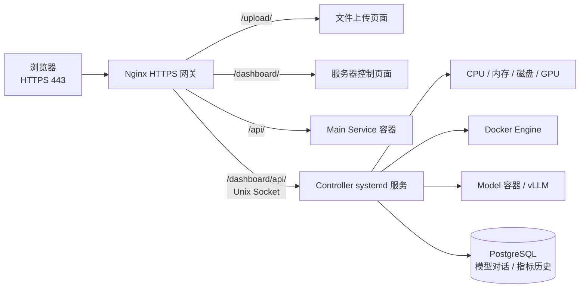

# Omni AI Controller

用于管理本机 `omni_ai_model` Docker 服务、采集硬件状态并与模型进行多轮对话。项目同时提供交互式控制台和由 systemd 托管的宿主机控制 API。

## 系统架构



只有 Nginx 对外监听 HTTPS 443。控制 API 通过挂载到网关容器中的 Unix Socket 提供，不开放额外 TCP 端口，也不将 Docker Socket 暴露给容器。

## 功能

- 首次运行时填写并记住 `omni_ai_model` 仓库目录。
- 后台启动模型容器并加载模型。
- 停止模型但保留控制器容器。
- 查看 Docker 容器、模型 readiness 和 GPU 状态。
- 开启新对话、选择是否启用思考模式、发送多轮消息。
- 查看最近一次模型 output 和当前对话历史。
- 打开容器 Shell，或停止整个容器。
- 通过受保护的 HTTP API 查询 CPU、内存、磁盘和 NVIDIA GPU 状态。
- 仅对固定白名单中的容器执行启动、停止、重启和日志读取。
- 为 `/dashboard/` 网页提供模型状态、生命周期控制和对话能力。
- 为 Dashboard 提供可创建、选择、重命名和删除的持久化多对话；用户消息与模型回复自动保存。
- 每次生成时从数据库恢复最近 32 条上下文，刷新页面或更换浏览器后仍可继续对话。
- 每 5 秒采集 CPU、内存、数据磁盘和首块 NVIDIA GPU，并提供五分钟、一天、一周、一月和一年历史曲线。
- 自动将旧数据降采样：5 秒保留 48 小时、1 分钟保留 45 天、15 分钟保留 400 天、1 小时保留 3 年。
- GPU 曲线包含利用率、显存、温度和板卡功耗；整机功耗只有在检测到可信整机传感器时才会显示。
- 可在模型运行面板点击 OpenAI 模型图标，为凭证实验室配置可选视觉模型；默认使用 `gpt-4o`，也可切换 `gpt-4.1`。

程序只保存模型仓库路径。API 密钥始终直接读取模型仓库中的 `.env`，不会复制到控制器配置中。

## 运行

要求 Python 3.10 或更高版本。运行时仅使用 Python 标准库，无需安装额外依赖。

```bash
cd /opt/ai_server/omni_ai_controller
python3 -m omni_ai_controller
```

也可以直接运行入口脚本：

```bash
cd /opt/ai_server/omni_ai_controller
python3 run.py
```

首次运行会提示：

```text
请输入 omni_ai_model 目录 [/opt/ai_server/omni_ai_model]：
```

也可以显式指定目录：

```bash
python3 -m omni_ai_controller --model-dir /opt/ai_server/omni_ai_model
```

选择“启动容器并加载模型”后：

1. 如果控制器容器尚未运行，会调用模型仓库的部署脚本，以后台模式创建容器。
2. 重新读取部署脚本生成的 `.env`。
3. 通过受保护的控制 API 启动 vLLM 模型进程。
4. 首次启动时，模型权重由 vLLM 下载到模型仓库配置的 Docker 缓存卷。

退出本控制台或断开 SSH 不会停止后台容器。

## 可选安装

如果希望使用全局命令，可以在虚拟环境中安装：

```bash
python3 -m venv .venv
. .venv/bin/activate
pip install -e .
omni-ai-controller
```

## 安装宿主机控制服务

控制服务必须运行在宿主机上，以读取真实硬件状态并控制 Docker。安装脚本会创建独立虚拟环境、生成管理员令牌，并注册开机自动启动的 systemd 服务：

```bash
cd /opt/ai_server/omni_ai_controller
chmod +x scripts/install-service.sh
bash scripts/install-service.sh
```

服务配置保存在 `/etc/omni-ai-controller/service.env`，权限为 `0600`。管理员令牌不会由安装脚本打印；服务器管理员从该文件中取得令牌，并在独立的 `/admin-login/` 页面完成认证。控制器验证密钥后签发 12 小时有效的 HMAC 管理员会话和 CSRF token，原始管理员密钥不会写入 Cookie、网页存储或前端日志。

Dashboard 对话保存在 PostgreSQL 的 `ai_conversations` 和 `ai_messages` 表。数据库只在宿主机回环地址 `127.0.0.1:15432` 为 Controller 提供连接，不向局域网或公网开放。Controller 从 `/var/lib/omni-ai/config/database.env` 读取数据库凭据；该文件不得提交到 Git 或输出到日志。

当前管理 API 固定操作 `dashboard` 作用域，因此只能看到 Dashboard 创建的会话。数据模型同时预留 `account` 作用域和 `owner_account_id`，以后普通用户客服对话可复用同一组表，并由业务服务按登录账号隔离。

主要会话接口：

- `GET /conversations`：列出 Dashboard 对话。
- `POST /conversations`：创建新对话。
- `GET /conversations/{id}`：读取对话及消息历史。
- `PATCH /conversations/{id}`：修改标题。
- `DELETE /conversations/{id}`：软删除对话。
- `POST /conversations/{id}/chat`：保存用户消息、调用当前模型并保存模型回复。

硬件历史接口为 `GET /metrics/history?metric={cpu|memory|disk|gpu}&range={5m|1d|7d|30d|1y}`，沿用 Dashboard 管理员鉴权。后台采样线程直接读取宿主机指标，不调用 Docker 或模型状态接口；数据库暂时不可用时不会阻塞实时 `/overview`。

当前主机仅检测到 `amdgpu` 的局部 hwmon 功耗输入，不能代表整机，因此 `host_power_watts` 保持为空。NVIDIA GPU 的 `power_watts` 仍由 `nvidia-smi` 正常采集和展示。以后接入可信的 UPS、PDU 或外置整机功率计时，才应填充整机功耗字段。

## OpenAI 可选视觉模型

以下信息于 **2026-09-23** 根据 [OpenAI 官方模型目录](https://developers.openai.com/api/docs/models) 核对。官方当前可选的主要通用模型包括：

| API 模型 ID | 定位 | 图像输入 | 本系统状态 |
| --- | --- | --- | --- |
| `gpt-6-astra` | 面向最复杂推理和端到端任务的旗舰模型 | 支持 | 尚未接入凭证结构化协议 |
| `gpt-6-sol` | 智能、成本和代理工作流之间的平衡型号 | 支持 | 尚未接入凭证结构化协议 |
| `gpt-6-luna` | 面向高吞吐、成本敏感任务的轻量型号 | 支持 | 尚未接入凭证结构化协议 |
| [`gpt-4.1`](https://developers.openai.com/api/docs/models/gpt-4.1) | 非推理模型，约 1M token 上下文，擅长指令遵循 | 支持 | **可选视觉模型** |
| [`gpt-4o`](https://developers.openai.com/api/docs/models/gpt-4o) | 成熟的多模态模型，128K token 上下文 | 支持 | **默认视觉模型** |

系统目前只在凭证识图中开放 `gpt-4o` 和 `gpt-4.1`，默认 `vision_model = "gpt-4o"`。这是刻意设置的服务端白名单：避免管理员输入任意模型名或外部 API 地址，并确保返回值能够转换为现有 OCR/金额提取结构。模型目录会随 OpenAI 调整，升级白名单前应重新核对模型可用性、价格和弃用公告。

配置和调用流程：

1. 管理员进入 `/dashboard/`，在“模型运行时”点击 GPT-4o 图标。
2. 选择 `gpt-4o` 或 `gpt-4.1`，在密码输入框中填写自己的 OpenAI API 密钥。
3. Controller 将密钥原子写入 `/etc/omni-ai-controller/openai-vision.json`，文件权限固定为 `0600`；GET 接口只返回 `configured` 状态，绝不返回密钥或密钥片段。
4. 凭证实验室可逐次选择“PP-OCRv6 · 本地”或“OpenAI · 云端识图”。主服务通过 Unix Socket 和独立内部令牌调用 Controller，只有 Controller 能读取 OpenAI 密钥并访问固定的 `https://api.openai.com/v1/chat/completions`。
5. 图片选择 OpenAI 引擎时会发送给 OpenAI API；选择 PP-OCRv6 时图片保持在本机 Docker 网络内。单张 OpenAI 识图图片限制为 20 MiB。

相关管理接口：

- `GET /vision/settings`：返回模型白名单、当前模型和是否已配置，不返回密钥。
- `PUT /vision/settings`：保存模型及可选的新密钥；浏览器请求必须通过管理员会话与 CSRF 校验。
- `DELETE /vision/settings/key`：删除已保存的 OpenAI 密钥并立即停用云端识图。
- `POST /internal/vision/receipts`：仅供主服务通过 Unix Socket 和 `VISION_INTERNAL_TOKEN` 调用，不对浏览器开放。

密钥不会写入 PostgreSQL、浏览器存储、容器镜像、Git、响应内容或正常日志。移除密钥后，本地 Qwen 和 PP-OCRv6 仍可照常运行。保存配置不会验证或消费密钥；只有管理员主动选择 OpenAI 引擎处理凭证时才会产生 OpenAI API 请求和费用。

默认安全策略：

- 只允许 `192.168.192.0/24` 客户端。
- 只允许控制 `omni-ai-model`、`omni-ai-receipt-ocr`、`omni-ai-main-service` 和 `omni-ai-database`。
- 不允许传入任意 Docker 命令、Shell 命令或 Compose 路径。
- 控制服务仅监听 `/run/omni-ai-controller/controller.sock`。
- 控制操作写入 systemd journal 审计日志。

常用运维命令：

```bash
systemctl status omni-ai-controller
journalctl -u omni-ai-controller -f
systemctl restart omni-ai-controller
```

## 测试

```bash
python3 -m pytest -q
```
